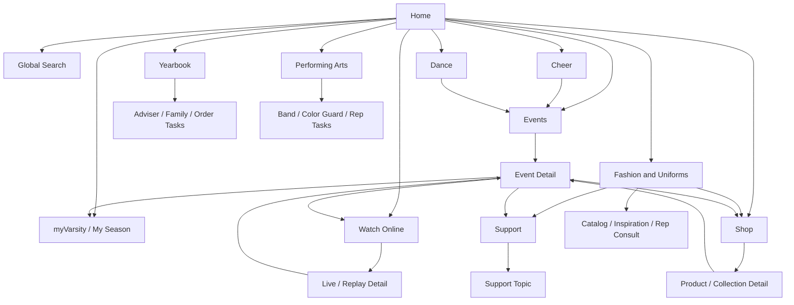
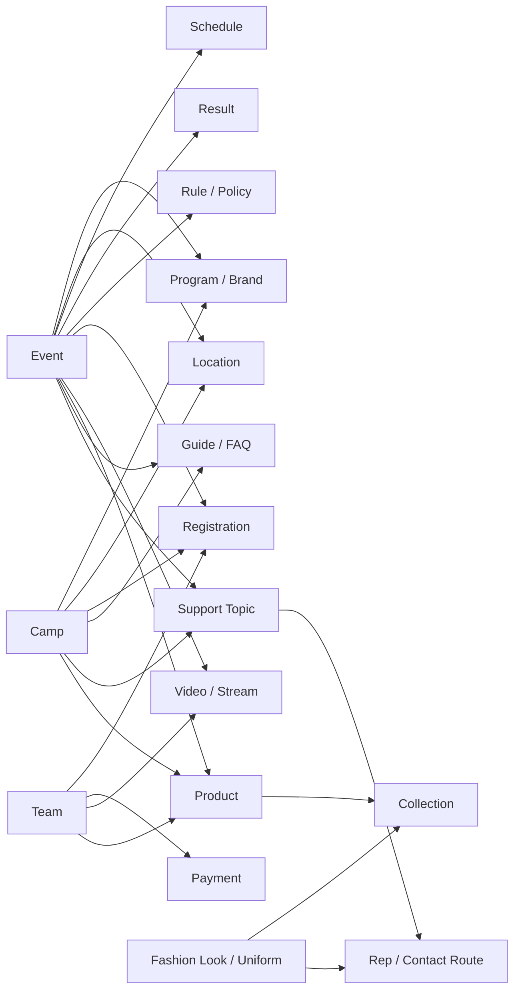
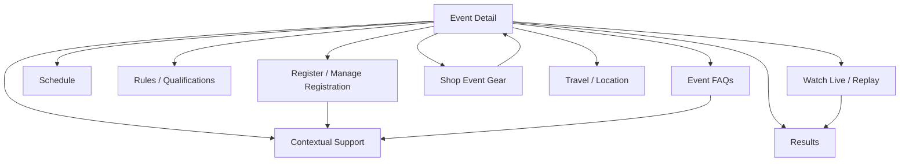

# Varsity.com Information Architecture Map

## Purpose

Varsity.com needs to support a complicated business without making visitors feel the complexity. The best IA model is not one giant sitemap. It is a layered map:

1. Public navigation: the simple choices visitors see.
2. Task journeys: the paths coaches, parents, athletes, fans, and teams actually follow.
3. Content model: the reusable entities the site needs to manage cleanly.
4. SEO templates: the indexable page types that help search engines understand Varsity's coverage.

The guiding rule: visitors should start with a task, while the system quietly connects events, camps, fashion, Varsity TV, shopping, account actions, and support.

Important operating assumption: Varsity.com is often the front door, not the final transaction system. Many visitors will complete their task somewhere else, such as a registration platform, Varsity TV, a commerce experience, an account/payment tool, a catalog or rep workflow, or a support channel. The IA should make those handoffs feel intentional, clear, and low-friction.

## Front-Door IA Model

Varsity.com should act as a task router:


Every major page should answer five questions quickly:

| Question | Page responsibility |
| --- | --- |
| Am I in the right place? | Name the event, camp, product, stream, support topic, or guide clearly |
| What do I need to know before I leave? | Surface dates, deadlines, requirements, location, status, and key details |
| Where do I go to complete the task? | Provide a primary handoff CTA to the correct destination |
| What will happen after I click? | Set expectations about sign-in, payment, registration, watching, shopping, or support |
| How do I get help or come back? | Provide contextual support and a return path |

## Handoff Destination Map

Because Varsity.com is a front door, each content area needs explicit destination mapping.

| Visitor task | Varsity.com page role | Likely completion destination | Handoff CTA examples |
| --- | --- | --- | --- |
| Register for an event | Explain event, deadlines, divisions, requirements, and status | Registration platform or myVarsity flow | Register, Manage registration |
| Pay or review balance | Explain deadline and connect account context | Payment/account system | Review payment, Make payment |
| Complete roster | Explain what is needed and why | Roster/account system | Complete roster |
| Find an event schedule | Provide indexable event context and latest update signal | Schedule module/system of record, or hosted schedule page | View schedule |
| Watch live or replay | Connect event/team context to coverage | Varsity TV | Watch live, View replay |
| Buy event merchandise | Connect event context to products | Commerce store | Shop event gear |
| Order uniforms or start fashion consult | Inspire, educate, qualify, and route | Rep workflow, catalog, or commerce path | Contact my rep, View catalog |
| Register for camp | Explain camp fit, dates, location, and requirements | Camp registration flow | Register for camp |
| Get support | Diagnose issue type and gather context | Support form, help center, chat, phone, or rep route | Get help, Contact support |
| Learn rules or deadlines | Provide clear answers and related next steps | Usually Varsity.com, then linked task destination | View rules, Start registration |

Handoff links should be treated as first-class IA objects, not just buttons. Each handoff should have:

- Destination owner
- System of record
- Required user context
- Sign-in expectation
- Tracking/event name
- Fallback support route
- Return destination
- Last verified date

## Recommended Top-Level IA



## Public Navigation

The header should stay simple. These are the primary visitor-facing sections:

| Nav item | Visitor intent | What belongs here |
| --- | --- | --- |
| Cheer | Start with the cheer activity and route into the right task | Cheer camps, competitions, School, All Star, resources, Fashion and Uniforms, Watch Online, and support |
| Dance | Start with the dance activity and route into the right task | Dance camps, competitions, UDA/NDA, CLI Studios, rules/scoring, Fashion and Uniforms, Watch Online, and support |
| Events | Find, understand, register for, manage, pay for, or follow an event | Camps, competitions, schedules, results, tickets, event gear, Watch Online, and myVarsity paths |
| Yearbook | Route adviser, student, family, and school tasks | Adviser tools, student/family ordering, eShare, workshops, login, and rep paths |
| Performing Arts | Route directors and families to products, events, and reps | Band Wear, Color Guard, Stanbury, catalog, events, and rep paths |
| Fashion and Uniforms | Team apparel orders, coach-led uniform needs, catalogs, and inspiration | Catalogs, sizing, rep consultation, team apparel, My Team Shop, and Shop handoff |
| Watch Online | Watch or follow Varsity TV coverage | Live events, upcoming streams, replays, saved teams, event video pages |
| Shop | Individual product and event-merchandise shopping | Parent, athlete, fan, and general-customer shopping paths |

Utility navigation should carry:

| Utility item | Purpose |
| --- | --- |
| Search | Cross-site discovery across events, camps, videos, products, guides, and support |
| Watch Online / Varsity TV | Direct shortcut for high-intent watch traffic |
| Support | Direct shortcut for help |
| myVarsity | Signed-in registrations, rosters, payments, saved teams, alerts, and support status |

If a task is completed outside Varsity.com, the navigation label should still use the visitor's language. For example, "Register" can point to a registration system, and "Watch live" can point to Varsity TV. The page should make the destination clear at the moment of handoff.

## Audience Overlay

Audience should personalize content, not overcomplicate the main navigation. The same IA can shift recommendations and calls to action by role.

| Audience | Primary needs | Recommended default shortcuts |
| --- | --- | --- |
| Coach | Plan season, register team, manage roster, track deadlines, coordinate uniforms | Find competitions, register, review deadlines, find camps, contact rep |
| Parent | Follow athlete, understand logistics, pay, watch, find official answers | Event details, travel, livestream, payments, support |
| Athlete | Prepare for camp, game day, and competition | Camp info, schedules, uniforms, shoes, replays, event details |
| Fan | Watch, follow results, shop event gear | Watch live, replays, results, event merchandise |
| Team admin | Complete operational tasks | Registrations, rosters, payment status, support cases |

Program lanes can be filters, landing pages, and personalization tags:

| Program lane | IA use |
| --- | --- |
| School | Event, camp, fashion, rules, and registration filtering |
| All Star | Event, camp, qualification, results, and Varsity TV filtering |
| Youth / Rec | Event, camp, support, and getting-started filtering |
| Performing Arts | Fashion, events, education, and support routing |
| Yearbook | Learn, products/services, support, and account routing |
| Fans | Watch, results, news/guide content, event merchandise |

## Content Model

This is the deeper IA behind the simple navigation. It lets one event page connect registration, livestreams, results, merchandise, travel, and FAQs without scattering visitors across unrelated pages.



## SEO Page Template Map

SEO should be handled with purposeful page templates, not random landing pages. Each template needs unique value, clean metadata, breadcrumbs, schema where appropriate, and strong internal links.

| Template | Example URL pattern | SEO purpose | Required content blocks |
| --- | --- | --- | --- |
| Events hub | `/events/` | Broad discovery for competitions and events | Search, filters, featured events, date/location links, program links, FAQs |
| Competition category | `/events/competitions/` | Capture competition intent | Filtered event list, intro copy, upcoming dates, rules/deadlines links, FAQs |
| Event detail | `/events/{event-slug}/` | Own event-specific queries and route visitors to task destinations | Name, dates, location, registration status, schedule, results, rules, travel, watch, merchandise, FAQs, last updated, destination CTAs |
| Event schedule | `/events/{event-slug}/schedule/` | Capture schedule-specific searches | Schedule by date, venue, division, team, update notices, link back to event |
| Event results | `/events/{event-slug}/results/` | Capture results searches | Results by division/team/date, replay links, related event links |
| Event rules | `/events/{event-slug}/rules/` | Capture rules and qualification searches | Rules, eligibility, bid/qualification info, deadlines, FAQs |
| Camps hub | `/camps/` | Broad camp discovery | Finder, location/date/program filters, camp types, registration help |
| Camp detail | `/camps/{camp-slug}/` | Own camp-specific searches and route to registration | Name, dates, location, program, team type, goals, registration, what to bring, FAQs, destination CTA |
| Location landing | `/events/locations/{location-slug}/` or `/camps/locations/{location-slug}/` | Capture "near me" and city/state searches | Unique location intro, events/camps list, dates, travel/help links |
| Fashion hub | `/fashion/` | Broad uniform/team apparel discovery and route to catalog, rep, or shopping paths | Uniform categories, catalogs, collections, sizing, team looks, rep CTA |
| Fashion category | `/fashion/{category-slug}/` | Capture product/service category searches | Category copy, collections, sizing/help, rep CTA, FAQs |
| Watch hub | `/watch/` | Varsity TV discovery and route to viewing destination | Live now, upcoming, replays, saved teams, event coverage |
| Video detail | `/watch/{video-or-event-slug}/` | Capture livestream/replay queries | Video metadata, related event, teams, schedule, replay status, subscription/save CTA |
| Shop hub | `/shop/` | Commerce discovery | Product categories, event merchandise, team collections |
| Shop category | `/shop/{category-slug}/` | Product category SEO | Products, filters, sizing, support, related events/collections |
| Event merchandise | `/shop/events/{event-slug}/` | Capture event merch intent and route to commerce | Event-linked products, deadlines, shipping/pickup info, link to event |
| Learn hub | `/learn/` | Educational and answer content | Topic groups, guides, popular questions, dates/deadlines |
| Guide detail | `/learn/{guide-slug}/` | Long-tail informational SEO | Direct answer, steps, related event/camp/fashion/support links, last updated |
| Support hub | `/support/` | Help discovery and issue routing | Issue categories, contact routes, popular questions |
| Support topic | `/support/{topic-slug}/` | Capture support queries | Answer, steps, escalation path, related account/event links, FAQs |

## URL And Indexing Rules

Use clean, stable URLs that mirror the IA. Avoid exposing internal systems, temporary filters, or account workflows as SEO pages.

| Page type | Indexing recommendation |
| --- | --- |
| Event, camp, fashion, watch, shop, learn, and support hubs | Index |
| Event detail, camp detail, guide detail, support topic, product/category detail | Index when content is unique and useful |
| Schedule, results, rules, location landing pages | Index when content is substantial and not duplicate |
| Filtered search results | Usually noindex or canonicalize to the nearest stable hub |
| Account, payment, roster, registration forms | Noindex |
| Saved teams, alerts, personalized dashboards | Noindex |
| Thin autogenerated pages | Noindex until content quality is strong |

Recommended canonical strategy:

| Situation | Canonical target |
| --- | --- |
| Event page with tracking or filtered parameters | Event detail page |
| Schedule/result filters | Main schedule/result page unless a filter has unique search demand and content |
| Product filters | Category page unless a filtered landing page is intentionally built |
| Location plus program pages | Keep indexable only when each combination has unique content and real inventory |

## Cross-Linking Model

The site should feel organized because every detail page connects the next likely task.



Use these linking rules:

| Source page | Must link to |
| --- | --- |
| Event detail | Register, schedule, results, rules, watch, event merchandise, travel, support |
| Camp detail | Register, related camps, fashion/team gear, what to bring, support |
| Fashion page | Sizing, catalogs, rep contact, related camps/events, shop products |
| Watch page | Related event, results, schedule, saved teams, merchandise |
| Shop page | Related event/camp/fashion context, sizing/support, checkout |
| Guide page | Relevant event/camp/fashion/shop/support task |
| Support topic | Relevant account task, event/camp/product page, contact route |

## Search Experience IA

Search should not be a generic list. It should group results by intent:

| Result group | Example results |
| --- | --- |
| Events | Competitions, event detail pages, schedules, results, rules |
| Camps | Camp detail pages, camp locations, registration |
| Watch | Live events, upcoming streams, replays |
| Fashion | Uniforms, catalogs, sizing, rep consults |
| Shop | Shoes, apparel, event merchandise |
| Support | Account, registration, payment, Varsity TV, fashion support |
| Learn | FAQs, guides, deadlines, rules explainers |

Search result cards should show type, title, date/location when relevant, and the next action.

## Recommended Page Template Details

### Event Detail Template

Required sections:

- Event name, dates, location, and status
- Registration CTA and deadlines
- Schedule module
- Results module
- Rules, bid, qualification, and division information
- Varsity TV live/replay module
- Travel/location information
- Event merchandise
- FAQs
- Support route
- Last updated date
- Breadcrumbs

Structured data candidates:

- Organization
- Event
- BreadcrumbList
- FAQPage, when the page includes visible FAQs
- VideoObject, when live/replay video detail is present
- Product, when event merchandise is presented as product detail content

### Camp Detail Template

Required sections:

- Camp name, dates, location, and program
- Who it is for
- Team goals or camp focus
- Registration CTA and deadlines
- What to bring / what to expect
- Related camps
- Fashion or gear recommendations when relevant
- FAQs
- Support route
- Last updated date

### Fashion Template

Required sections:

- Category, collection, or team look
- Program/team type relevance
- Product or catalog links
- Sizing help
- Rep consultation CTA
- Related camps/events
- FAQs
- Support route

### Watch Template

Required sections:

- Live, upcoming, or replay status
- Event/team association
- Schedule context
- Save/follow CTA
- Related event details
- Results link when available
- Event merchandise link when relevant

### Support Template

Required sections:

- Plain-language answer
- Steps to resolve
- Required account or event information
- Escalation/contact route
- Related tasks and FAQs
- Last updated date

## Governance Rules

These rules keep the IA tidy as the site grows.

| Rule | Why it matters |
| --- | --- |
| One canonical detail page per event, camp, product, guide, and support topic | Prevents duplication and confusing search results |
| Navigation stays task-led, not org-chart-led | Visitors do not need to understand Varsity's internal structure to use the site |
| Program, audience, location, date, and brand are metadata first | They can power filters and landing pages without crowding the nav |
| Every indexed page needs a clear owner and last-updated date | Event, rules, deadline, and support content must stay trustworthy |
| No indexable page without a next action | SEO traffic should land visitors near the correct task destination |
| Personalized pages stay out of the index | myVarsity should help signed-in users, not create search clutter |
| External task destinations are documented in the IA | Front-door pages need ownership, fallback routes, and clear handoff language |

## Handoff UX Rules

These rules keep front-door pages from feeling like dead ends.

| Rule | Why it matters |
| --- | --- |
| Put the primary task CTA above the fold on high-intent pages | Visitors who know what they need should not have to hunt |
| Tell visitors when a CTA takes them to another Varsity destination or system | Handoffs feel safer when expectations are clear |
| Preserve context in the handoff whenever possible | Event, team, camp, and product context should not be re-entered |
| Keep a contextual support link near every major CTA | Failed handoffs often become support needs |
| Avoid duplicating transaction content that belongs to another system | Varsity.com should summarize and route, not create stale copies |
| Track handoff success separately from page engagement | The key outcome may happen after the visitor leaves Varsity.com |

## Front-Door Success Metrics

Measure Varsity.com by how well it routes people, not only by how long they stay.

| IA area | Success signal |
| --- | --- |
| Search | Query leads to the right event, camp, video, product, guide, or support page |
| Event pages | Visitor clicks register, schedule, watch, results, merchandise, or support |
| Camp pages | Visitor clicks registration, related camp, fashion/gear, or support |
| Fashion pages | Visitor clicks catalog, rep consult, product, sizing, or support |
| Watch pages | Visitor reaches live stream, replay, saved-team action, or related event |
| Support pages | Visitor selects the correct issue route and does not immediately restart search |
| myVarsity | Visitor reaches the right signed-in task with context preserved |

## Working Sitemap Draft

```text
/
  /events/
    /events/competitions/
    /events/locations/{location-slug}/
    /events/{event-slug}/
      /events/{event-slug}/schedule/
      /events/{event-slug}/results/
      /events/{event-slug}/rules/
      /events/{event-slug}/travel/
      /events/{event-slug}/watch/
      /events/{event-slug}/merchandise/
  /camps/
    /camps/locations/{location-slug}/
    /camps/programs/{program-slug}/
    /camps/{camp-slug}/
  /fashion/
    /fashion/uniforms/
    /fashion/catalogs/
    /fashion/sizing/
    /fashion/team-looks/
    /fashion/contact-a-rep/
  /watch/
    /watch/live/
    /watch/upcoming/
    /watch/replays/
    /watch/events/{event-slug}/
  /shop/
    /shop/shoes/
    /shop/apparel/
    /shop/accessories/
    /shop/event-merchandise/
    /shop/events/{event-slug}/
  /learn/
    /learn/rules/
    /learn/deadlines/
    /learn/registration/
    /learn/{guide-slug}/
  /support/
    /support/registration/
    /support/payments/
    /support/account/
    /support/events/
    /support/camps/
    /support/fashion/
    /support/varsity-tv/
  /my-varsity/
    /my-varsity/registrations/
    /my-varsity/rosters/
    /my-varsity/payments/
    /my-varsity/saved-teams/
    /my-varsity/support/
```

## Implementation Recommendation

The strongest way to map and manage this IA is a matrix, not just a tree:

| Layer | What to document | Best artifact |
| --- | --- | --- |
| Visitor navigation | Header, utility nav, footer, mobile quick actions | Simple sitemap |
| User journeys | Coach, parent, athlete, fan, team admin paths | Journey map |
| Content model | Events, camps, products, videos, support topics, guides, teams, locations | Entity relationship map |
| SEO | Indexable templates, canonical rules, schema, metadata, internal links | SEO template matrix |
| Governance | Owners, freshness, duplication rules, noindex rules | IA operating rules |

This approach lets Varsity.com appear simple while still supporting the full business underneath.
