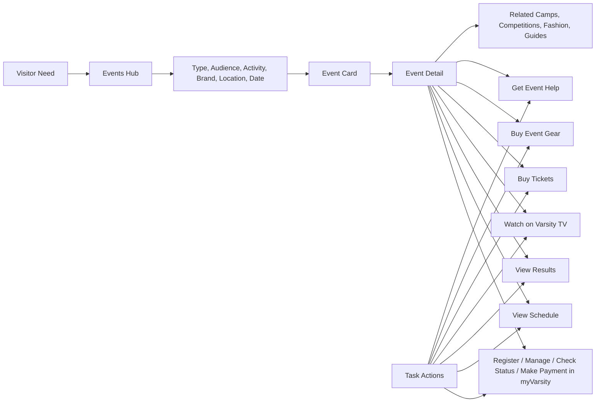
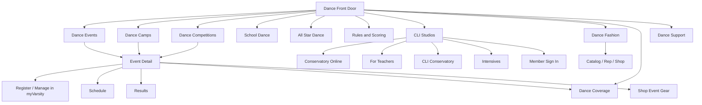
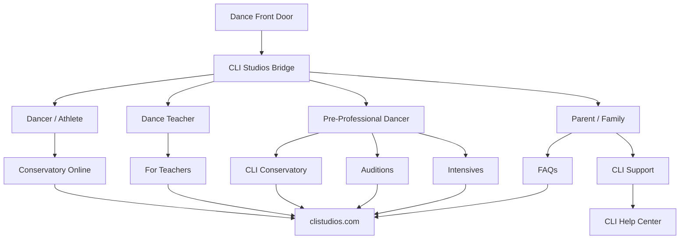
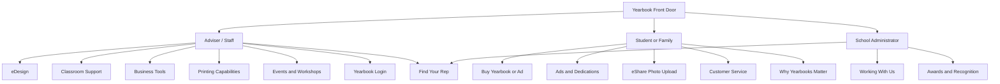
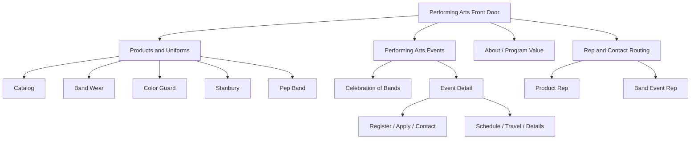
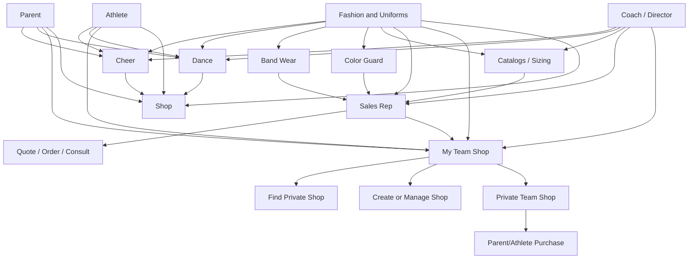
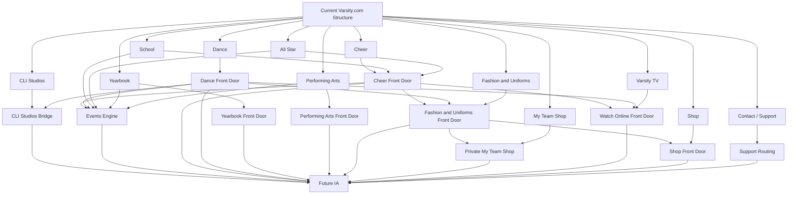

# Varsity.com Information Architecture V2

## Executive Recommendation

Varsity.com should be organized as a front door and routing system, not as one giant destination where every task is completed.

The important correction from the first pass: Camps and Competitions are both Events. The Events IA should become the shared discovery layer for camps, competitions, special events, Spirit Days, performing arts events, workshops, schedules, results, watch links, registration, status checks, payments, tickets, event gear, and related support.

At the same time, Varsity.com still needs strong top-level business front doors in this order:

- Cheer
- Dance
- Events
- Yearbook
- Performing Arts
- Fashion and Uniforms
- Watch Online
- Shop

Support should remain contextual and visible from relevant pages, but it should not compete as a primary business front door.

The site can feel simple if the navigation is task-led, but the deeper system should keep all current information findable and connected.

## Current-Site Inventory To Preserve

This v2 IA is based on the local prototype notes plus a current review of Varsity.com on June 2, 2026.

Current Varsity.com information that should not be lost:

| Current area | Current information to preserve | Future IA treatment |
| --- | --- | --- |
| School | Camps, Competitions, Fashion, Youth/Rec, Resources, Fundraising, Spirit Raising, Varsity University, College Job Openings, News | Keep as a front door for school coaches, parents, athletes, and administrators. Route camps and competitions into Events. |
| All Star | Competitions, virtual competitions, end-of-season events, The Summit family, Cheer and DanceABILITIES, Scoring and Judges, Brands, Results, Fashion, Youth/Rec, International, Varsity Cheer League, Resources, News | Keep as a front door for gyms, owners, coaches, parents, athletes, and fans. Route competitions and event collections into Events. |
| Camps | Register for Camp, Why Varsity Camps, Brands, Game Day, Special Events, Spirit Days, Additional Opportunities | Treat as Event type = Camp, surfaced under Events and under School/All Star/Youth/Rec as appropriate. |
| Competitions | Dates and locations, Why Varsity Competitions, Brands, Game Day, Results, Watch Live, ticket buying, event gear, Competition Specialist | Treat as Event type = Competition, surfaced under Events and under the right program front door. |
| Yearbook | Working With Us, eDesign, Classroom Support, Business Tools, Printing Capabilities, Awards and Recognition, Events and Workshops, Students and Families, Ads and Dedication, Why Yearbooks Matter, Buy a Yearbook, eShare, Customer Service, Current Advisers, Yearbook Login, Find Your Rep | Keep as its own top-level front door. Route adviser, family, rep, workshop, order, and support tasks clearly. |
| Performing Arts | Catalog, Celebration of Bands, Band Wear, Color Guard, Pep Band, Stanbury Uniforms, Events, Contact your Band Event Rep | Keep as its own top-level front door. Route product, uniform, event, catalog, and rep tasks clearly. |
| CLI Studios | Conservatory Online, For Teachers, CLI Conservatory, auditions, faculty, FAQs, intensives, member sign-in, blog, gifts, and support | Add as a named Dance pathway and owned-company bridge from Varsity.com to CLI Studios. |
| Fashion and Uniforms | Catalogs, Cheer, Dance, Band Wear, Color Guard, Letter Jackets, Request Catalog, Uniforms, Collections, Shoes, Dance Exclusives, Campwear, Game Day, Outerwear, Accessories, College, STUNT, Junior Varsity, Varsity Beauty, Brand Ambassadors, Reveals, FAQ, Style Story, and My Team Shop access | Keep as a top-level flat product/service area for team apparel orders, coach-led uniform needs, catalogs, inspiration, rep support, and private My Team Shop access. Anyone can browse catalogs and uniform/fashion inspiration, but many purchases are coach or director led. |
| Watch Online | Live stream schedule, sign up, Varsity Cheer League, films, event coverage | Keep as a top-level utility/front door and connect it from every relevant event detail page. |
| Shop | Shoes, Poms, Apparel, Activewear, Beauty, Accessories, Bags and Backpacks, event merchandise, and individual commerce | Keep as a top-level external handoff and contextual commerce path for individual customers. Anyone can shop, but the primary audiences are parents, athletes, and fans. Do not make Shop carry the coach-led uniform procurement journey by itself. |
| About / Education / Safety | Mission, culture, philanthropy, partners, press, team, legends, research, careers, FAQ, Varsity University, Library, Sportsmanship, Athlete Protection, Mental Health | Keep in footer/utility and cross-link from Support, Learn, Events, and program pages. |
| Contact | Audience picker, topic picker, customer service, corporate address | Reframe as Support with better issue routing. |

## Recommended Top-Level Navigation

Primary navigation should be shorter than the current business complexity, but it should not bury major business lines.

Recommended primary nav:

1. Cheer
2. Dance
3. Events
4. Yearbook
5. Performing Arts
6. Fashion and Uniforms
7. Watch Online
8. Shop

Support should move into utility navigation, footer navigation, search, and contextual page-level help.

Dance should not be treated only as a filter inside School or All Star. Dance needs a visible hub and a featured lane across School, All Star, Events, Fashion and Uniforms, Watch, Learn, Search, and the home page.

CLI Studios should be a featured destination inside Dance because Varsity owns that dance training ecosystem. Varsity.com should introduce and route to CLI, while CLI Studios remains the completion destination for online classes, teacher training, conservatory, auditions, intensives, member sign-in, and CLI support.

Recommended utility nav:

| Utility item | Purpose |
| --- | --- |
| Search | Cross-site discovery across events, programs, products, videos, yearbook, performing arts, support, and news |
| myVarsity | Account, registration, rosters, payments, saved items, status checks, and signed-in tasks for most events through the Events Registration and Management Platform |
| Personalize | School, All Star, Youth/Rec, Parent, Athlete, Fan, Adviser, Director, or "see it all" |
| Contact | Shortcut into routed support |

Recommended mobile priority nav:

| Mobile item | Why it belongs in the always-visible top row |
| --- | --- |
| Cheer | Highest-volume activity front door and first top-level IA item. |
| Dance | Must be more discoverable as its own activity front door. |
| Events | Shared engine for camps, competitions, schedules, results, tickets, event gear, and registration/status/payment paths. |
| myVarsity | High-frequency account and event-management destination. |

The full primary navigation should remain available from the hamburger Menu on mobile, but the always-visible mobile row should be limited to the highest-frequency routes: Cheer, Dance, Events, and myVarsity. Help should remain available through contextual support links, the footer, search, and the full menu when appropriate.

Recommended footer IA:

| Footer group | What belongs there |
| --- | --- |
| Explore | Cheer, Dance, Events, Yearbook, Performing Arts, Fashion and Uniforms, Watch Online, Shop. |
| Complete a Task | Register/manage/status/pay, find an event, buy tickets, buy event gear, find My Team Shop, contact a rep. |
| Support | Support hub, event help, myVarsity help, Fashion and Uniforms help, Yearbook help, Varsity TV help. |
| Company | About, education and safety, careers, press, privacy, terms, and other corporate/trust links. |
| Follow Varsity | Major official social platforms plus a link to an organized social directory. |

Social channels should be included in the footer, not the primary navigation. Use a compact "Follow Varsity" row for major platforms such as Instagram, TikTok, YouTube, Facebook, X, and LinkedIn, then provide an "All social channels" directory that organizes official accounts by master brand, activity, program, event, and platform. Event and brand pages can include contextual social links when they help the visitor, but the footer directory should remain the source of truth.

Recommended School / All Star brand module:

| Page context | Brand module behavior |
| --- | --- |
| Cheer > School | Show school cheer brand shortcuts such as UCA, NCA, UCA/UDA, and NSSC. Each shortcut opens Events filtered by Cheer, School, and that brand. |
| Dance > School | Show school dance brand shortcuts such as UDA, NDA, NCA/NDA, and UCA/UDA. Each shortcut opens Events filtered by Dance, School, and that brand. |
| Cheer > All Star | Show All Star cheer brand shortcuts such as Varsity All Star, UCA/UDA, and Spirit Sports. Each shortcut opens Events filtered by Cheer, All Star, and that brand. |
| Dance > All Star | Show All Star dance brand shortcuts, led by Varsity All Star. Each shortcut opens Events filtered by Dance, All Star, and that brand. |

These modules should use recognizable brand icons/logos in the real experience. In the wireframe they are represented as brand icon tiles. The key IA behavior is that brand selection should not send users to a disconnected brand page first; it should preserve activity and program context and immediately display relevant Events.

## Top-Level IA Flow

```mermaid
flowchart TD
  Home["Varsity.com Home"]
  Search["Search"]
  Cheer["Cheer"]
  Dance["Dance Hub"]
  Yearbook["Yearbook"]
  PerformingArts["Performing Arts"]
  Events["Events"]
  CLI["CLI Studios"]
  FashionUniforms["Fashion and Uniforms"]
  MyTeamShop["My Team Shop"]
  Watch["Watch Online"]
  Shop["Shop"]
  Support["Support"]
  MyVarsity["myVarsity"]

  Home --> Search
  Home --> Cheer
  Home --> Dance
  Home --> Events
  Home --> Yearbook
  Home --> PerformingArts
  Home --> FashionUniforms
  Home --> Watch
  Home --> Shop
  Home --> MyVarsity

  Cheer --> CheerEvents["Cheer Camps, Competitions, Results"]
  Cheer --> CheerFashion["Cheer Fashion and Uniforms"]
  Cheer --> SchoolAllStar["School / All Star"]
  Events --> EventDetail["Event Detail"]
  Dance --> DanceEvents["Dance Camps, Competitions, Results"]
  Dance --> SchoolAllStar
  Dance --> CLI
  Dance --> DanceFashion["Dance Fashion and Uniforms"]
  Dance --> DanceWatch["Dance Coverage"]
  Dance --> DanceLearn["Rules, Scoring, Guides"]
  SchoolAllStar --> Events
  SchoolAllStar --> FashionUniforms
  Cheer --> Learn["Learn / Safety / Resources"]
  FashionUniforms --> CheerFU["Cheer"]
  FashionUniforms --> DanceFU["Dance"]
  FashionUniforms --> BandWear["Band Wear"]
  FashionUniforms --> ColorGuard["Color Guard"]
  FashionUniforms --> Catalogs["Catalogs / Sizing"]
  FashionUniforms --> Rep["Request Catalog / Contact Rep"]
  FashionUniforms --> MyTeamShop
  FashionUniforms --> Shop
  MyTeamShop --> PrivateShop["Private Team Shop"]
  Yearbook --> YearbookTools["Adviser, Family, Order, eShare, Rep"]
  Yearbook --> YearbookEvents["Yearbook Events and Workshops"]
  PerformingArts --> PAProducts["Band Wear, Color Guard, Stanbury"]
  PerformingArts --> PAEvents["Performing Arts Events"]
  Watch --> TV["Varsity TV"]
  CLI --> CLISite["CLI Studios Destination"]
  Shop --> Store["Shop Destination"]
  Support --> ContactRoute["Topic-Based Help Route"]
  MyVarsity --> AccountTasks["Registration, Payment, Rosters"]

  EventDetail --> MyVarsity
  EventDetail --> Tickets["Buy Tickets"]
  EventDetail --> EventGear["Buy Event Gear"]
  EventDetail --> Watch
  EventDetail --> Shop
  EventDetail --> Support
```



## Events As The Shared Engine

Events should be the primary discovery system for all date/location/action-based experiences.

Events includes:

- Competitions
- Camps
- Special Events
- Spirit Days
- End-of-season events
- Performing Arts events
- Yearbook events and workshops
- Virtual events
- Varsity TV event coverage
- Ticketing for competitions and ticketed events
- Event gear and event-specific merchandise
- myVarsity status, registration, roster, and payment paths for most events

Events should be filterable by:

| Filter | Examples |
| --- | --- |
| Event type | Competition, Camp, Special Event, Spirit Day, Workshop, Performing Arts Event, Virtual Event |
| Audience | School, All Star, Youth/Rec, Parent/Fan, Adviser, Director |
| Activity | Cheer, Dance, Band, Color Guard, Yearbook, STUNT |
| Brand | UCA, NCA, USA, UDA, NDA, Varsity All Star, Varsity Yearbook, Varsity Performing Arts |
| Location | City, state, region, venue, near me |
| Date | This week, this month, summer, competition season, school year |
| Task | Register/manage/check status/make payment, Buy tickets, Buy event gear, Watch, View schedule, View results, Shop, Contact rep |
| Status | Registration open, registration closed, schedule posted, live soon, results available |

## Events Flow



## Recommended Events IA

| Section | What it contains | Notes |
| --- | --- | --- |
| `/events/` | Unified event finder | The main hub for camps, competitions, special events, performing arts events, workshops, and virtual events. |
| `/events/competitions/` | Competition finder | Includes School, All Star, Youth/Rec, end-of-season events, scoring, results, schedules, watch links, tickets, event gear, and myVarsity status/payment routes. |
| `/events/camps/` | Camp finder | Includes camp registration, camp brands, game day, special events, Spirit Days, additional opportunities. |
| `/events/special-events/` | Parades, performance trips, invitation experiences | Keeps current special events but makes them discoverable in the shared event system. |
| `/events/spirit-days/` | Spirit Days | Should remain discoverable from School and Events. |
| `/events/performing-arts/` | Performing Arts events | Mirrors from the Performing Arts front door. |
| `/events/yearbook-workshops/` | Yearbook events and workshops | Mirrors from Yearbook. |
| `/events/dance/` | Dance events | Mirrors from the Dance hub and includes dance camps, competitions, championships, schedules, results, and coverage. |
| `/events/tickets/` | Ticketing guide and event ticket discovery | Public guide/route for buying competition tickets; event-specific ticket purchase may hand off to a ticketing destination. |
| `/events/event-gear/` | Event merchandise discovery | Public guide/route for event-specific merchandise; event detail pages should deep-link to the right gear when available. |
| `/events/myvarsity/` | Registration/status/payment orientation | Explains that most event registration, status checks, payments, rosters, and management tasks happen through myVarsity and the Events Registration and Management Platform. |
| `/events/results/` | Results hub | Can support School, All Star, Youth/Rec, and Varsity TV result queries. |
| `/events/schedules/` | Schedule discovery | Helps searchers looking for performance order, dates, and livestream timing. |
| `/events/{event-slug}/` | Canonical event detail | One detail page per event when possible, with clear task actions for register/manage/check status/make payment, tickets, event gear, schedule, results, watch, and support. |

## Event Detail Action Cluster

Event detail pages should not only describe the event. They should route each visitor to the right next action.

Recommended action cluster:

| Action | Primary audience | Destination |
| --- | --- | --- |
| Register / manage / check status / make payment | Coach, gym owner, team admin, account payer, adviser/director when applicable | myVarsity / Events Registration and Management Platform for most events |
| Buy tickets | Parent, family, fan, athlete, coach | Ticketing destination or event-specific ticket flow |
| Buy event gear | Parent, athlete, fan, coach | Event merchandise / Shop destination |
| View schedule | Coach, parent, athlete, fan | Schedule source or Varsity.com schedule page |
| View results | Coach, parent, athlete, fan | Results source, event detail, or Varsity TV |
| Watch live/replay | Parent, athlete, fan, coach | Varsity TV |
| Get help | Any role | Event support route |

The page should only show actions that apply to that event. For example, some events may not have tickets, some may not have event gear, and some may not use myVarsity.

Event action status should be metadata:

| Metadata | Example values |
| --- | --- |
| Registration status | Opens soon, open, closes soon, closed, waitlist, invite-only, not applicable |
| myVarsity availability | Available, not available, coming soon, contact support |
| Payment status route | Available, not applicable, sign-in required |
| Ticket status | Available, coming soon, sold out, not applicable |
| Event gear status | Available, coming soon, not applicable |
| Watch status | Live now, live soon, replay available, not streamed |
| Results status | Posted, pending, not applicable |

## Cheer Front Door

Cheer should be the first top-level front door. It should orient school, all star, youth/rec, coach, athlete, parent, and fan visitors who primarily identify with cheer before routing them into Events, Fashion and Uniforms, Watch, Learn, Support, and myVarsity.

Recommended Cheer IA:

```text
/cheer/
  /cheer/events/
  /cheer/camps/
  /cheer/competitions/
  /cheer/results/
  /cheer/schedules/
  /cheer/rules-scoring/
  /cheer/fashion-uniforms/
  /cheer/watch/
  /cheer/school/
  /cheer/all-star/
  /cheer/youth-rec/
  /cheer/news-guides/
```

Cheer should connect to:

| Destination | Purpose |
| --- | --- |
| Events | Cheer camps, competitions, special events, schedules, results, tickets, event gear, registration/status/payment, and watch links |
| School / All Star | Existing audience/business pathways that many cheer customers recognize |
| Fashion and Uniforms | Cheer fashion, uniforms, catalogs, My Team Shop, and sales rep support |
| Watch | Cheer livestreams, replays, Varsity Cheer League, and event coverage |
| Learn / Safety | Rules, scoring, resources, Varsity University, sportsmanship, safety, and athlete protection |
| Support | Cheer event, registration, payment, ticket, event gear, fashion/uniform, and account help |

## Dance Front Door

Dance should be a first-class discovery lane because visitors search for dance by activity, program context, brand, event name, rules, results, apparel, and coverage. A dancer, coach, parent, or fan should be able to start from Dance and still choose School or All Star when that is how they understand their task.

Primary Dance audiences:

| Audience | Primary tasks |
| --- | --- |
| Dance coach | Find camps, competitions, rules/scoring, schedules, results, uniforms, registration, and support |
| Dance athlete | Find camp details, competition schedules, apparel, replays, and team resources |
| Parent / family | Find event details, travel, watch links, results, merchandise, and official answers |
| Fan | Watch live/replay, follow results, and shop event gear |
| Team admin | Manage registrations, rosters, payments, deadlines, and support |

Recommended Dance IA:

```text
/dance/
  /dance/cli-studios/
  /dance/events/
  /dance/camps/
  /dance/competitions/
  /dance/results/
  /dance/schedules/
  /dance/rules-scoring/
  /dance/fashion/
  /dance/watch/
  /dance/news-guides/
  /dance/uda/
  /dance/nda/
```

Dance should be featured in:

| Placement | Recommendation |
| --- | --- |
| Home page | Add a visible Dance card or quick action beside Events, Fashion, Watch, Yearbook, and Performing Arts. |
| Primary nav | Make Dance the second top-level front door, directly after Cheer. |
| Dance hub | Feature CLI Studios as a major training destination, not a small promo tile. |
| School and All Star | Include both as visible pathways from Dance, just as they are visible from Cheer. |
| Events hub | Include Dance as an activity filter and a promoted landing card. |
| Search | Group Dance results when the query includes dance, UDA, NDA, Dance Summit, dance camps, dance results, or dance uniforms. |
| Fashion | Add Dance as a major product pathway, not only a product category. |
| Watch | Add Dance event coverage, replays, and saved-team paths. |
| Support | Add Dance-specific event, registration, fashion, and Varsity TV support routes. |
| Footer | Include Dance in Programs or Popular Tasks. |

Dance Flow:



Dance SEO intent to support:

| Intent cluster | Examples |
| --- | --- |
| Dance camps | dance camps, UDA dance camp, NDA dance camp, dance camp near me |
| Dance competitions | dance competitions, UDA competitions, NDA competitions, dance nationals |
| Event-specific | Dance Summit schedule, Dance Team Championship results, UDA Nationals watch |
| Rules and scoring | dance rules, dance scoring, dance divisions, qualification requirements |
| Fashion and products | dance uniforms, dance shoes, dance team apparel, dance warmups |
| Watch/results | dance competition live stream, dance replay, dance results |

## CLI Studios Front Door Within Dance

CLI Studios needs a clear Varsity.com bridge because it expands the Dance IA beyond camps, competitions, uniforms, and coverage into year-round training and professional development.

Recommended role for Varsity.com:

| Varsity.com responsibility | CLI Studios responsibility |
| --- | --- |
| Introduce CLI Studios as Varsity's owned dance training company | Own the full CLI brand experience and conversion flow |
| Route dance coaches, teachers, athletes, and parents to the right CLI path | Host online training, teacher training, conservatory, auditions, intensives, account, and support |
| Connect CLI to Varsity dance events, UDA/NDA, Dance Summit, dance camps, and dance fashion | Provide program-specific details, pricing, trial/sign-up, and member experience |
| Provide SEO context and internal links from Varsity's broader dance ecosystem | Maintain canonical CLI content on clistudios.com |

Recommended Varsity.com bridge page:

```text
/dance/cli-studios/
  /dance/cli-studios/conservatory-online/
  /dance/cli-studios/for-teachers/
  /dance/cli-studios/conservatory/
  /dance/cli-studios/intensives/
  /dance/cli-studios/auditions/
```

These Varsity pages should be concise routing pages, not duplicate copies of CLI pages. They should answer:

- What is CLI Studios?
- Who is this for?
- Which CLI path should I choose?
- How does CLI connect to Varsity dance camps, competitions, and training goals?
- Where do I go next?

CLI Studios destination map:

| Visitor task | Varsity.com bridge | Completion destination |
| --- | --- | --- |
| Find online dance training | `/dance/cli-studios/conservatory-online/` | CLI Conservatory Online |
| Find training for dance teachers | `/dance/cli-studios/for-teachers/` | CLI For Teachers |
| Explore pre-professional conservatory | `/dance/cli-studios/conservatory/` | CLI Conservatory |
| Audition for CLI Conservatory | `/dance/cli-studios/auditions/` | CLI auditions path |
| Find intensives | `/dance/cli-studios/intensives/` | CLI summer, junior, fall, or winter intensives |
| Sign in as a CLI member | `/dance/cli-studios/` or utility link | CLI member sign-in |
| Get CLI help | `/support/dance/cli-studios/` | CLI support / knowledge base |

CLI Studios Flow:



SEO rule for CLI:

| Rule | Recommendation |
| --- | --- |
| Avoid duplicating CLI content on Varsity.com | Use Varsity pages to summarize and route; let CLI pages own detailed program content. |
| Make ownership explicit | Use Organization relationships and clear copy that positions CLI Studios as part of the Varsity dance ecosystem. |
| Cross-link both directions | Varsity Dance should link to CLI; CLI should link back to relevant Varsity dance events, camps, competitions, and coverage when appropriate. |
| Keep canonical content on the right domain | CLI program details should canonicalize to clistudios.com if the full content lives there. |
| Use structured data only when it matches visible content | Course, Organization, Event, FAQ, Breadcrumb, and Video schema may apply depending on page content. |

## Cheer, School, And All Star Front Doors

Cheer should be the first top-level activity front door. School and All Star should remain highly visible beneath and alongside Cheer because many customers understand themselves through those program contexts. Dance stays separate as the second top-level front door. Camps and competitions should no longer sit in a silo. They should feed from the unified Events model.

Recommended structure:

```text
/programs/
  /school/
    /school/events/
    /school/dance/
    /school/fashion/
    /school/resources/
    /school/news/
  /all-star/
    /all-star/events/
    /all-star/dance/
    /all-star/fashion/
    /all-star/scoring-and-judges/
    /all-star/resources/
    /all-star/news/
  /youth-rec/
    /youth-rec/events/
    /youth-rec/camps/
    /youth-rec/resources/
```

If current URLs stay in place, use the future structure as a conceptual layer rather than an immediate URL replacement. For example, `/school/camps/` can remain live while also being powered by and cross-linked from `/events/camps/?audience=school`.

## Yearbook Front Door

Yearbook should not be hidden inside Learn or Resources. It is a distinct business line with different users and task destinations.

Primary Yearbook audiences:

| Audience | Primary tasks |
| --- | --- |
| Adviser | Log in, use eDesign, access classroom support, manage production, find tools, contact rep |
| Student staff | Learn tools, submit content, participate in workshops, build pages |
| Parent / family | Buy a yearbook, buy an ad or dedication, upload photos through eShare, get customer service |
| School administrator | Understand program value, printing capabilities, business tools, awards, rep relationship |

Recommended Yearbook IA:

```text
/yearbook/
  /yearbook/advisers/
    /yearbook/advisers/edesign/
    /yearbook/advisers/classroom-support/
    /yearbook/advisers/business-tools/
    /yearbook/advisers/printing/
    /yearbook/advisers/awards-recognition/
    /yearbook/advisers/events-workshops/
  /yearbook/students-families/
    /yearbook/students-families/buy-a-yearbook/
    /yearbook/students-families/ads-dedications/
    /yearbook/students-families/eshare/
    /yearbook/students-families/customer-service/
    /yearbook/students-families/why-yearbooks-matter/
  /yearbook/find-your-rep/
  /yearbook/login/
```

Yearbook destination handoffs:

| Task | Destination type |
| --- | --- |
| Buy a yearbook or ad | Yearbook Order Center |
| Submit photos | eShare |
| Adviser login | Adviser/account login |
| Learn Tag Wizard or yearbook tools | Yearbook Discoveries / tool detail |
| Find a rep | Rep finder |
| Customer service | Yearbook customer service |

## Yearbook Flow



## Performing Arts Front Door

Performing Arts should also be a top-level front door because its audience, products, and events differ from cheer/dance while still belonging to Varsity's spirit ecosystem.

Primary Performing Arts audiences:

| Audience | Primary tasks |
| --- | --- |
| Band director | View catalog, outfit band, explore Stanbury, contact event/product rep |
| Color guard director | Explore color guard uniforms and accessories, request catalog, contact rep |
| Student / family | Understand event opportunities, performance details, ordering or support |
| School administrator | Understand program value, purchasing, service, event opportunities |

Recommended Performing Arts IA:

```text
/performing-arts/
  /performing-arts/catalog/
  /performing-arts/band-wear/
  /performing-arts/color-guard/
  /performing-arts/stanbury/
  /performing-arts/pep-band/
  /performing-arts/events/
    /performing-arts/events/celebration-of-bands/
  /performing-arts/contact-rep/
```

Performing Arts destination handoffs:

| Task | Destination type |
| --- | --- |
| View catalog | Catalog or Stanbury destination |
| Explore Band Wear | Varsity.com or catalog/product pages |
| Explore Color Guard | Varsity.com or catalog/product pages |
| Learn about Stanbury uniforms | Stanbury destination |
| Contact Band Event Rep | Rep/contact form |
| Register for Celebration of Bands or related events | Event registration/contact path |

## Performing Arts Flow



## Fashion And Uniforms

Fashion and Uniforms should be one flat front door, not a two-step structure with separate "Fashion" and "Uniforms" subpages.

The section still needs to support different buying behaviors, but the navigation should route directly to activity, category, catalog/rep, My Team Shop, and Shop paths.

| Area | Primary audience | Visitor mindset | IA role |
| --- | --- | --- | --- |
| Activity/product paths | Coach, parent, athlete, fan | Help me find the right cheer, dance, band, color guard, campwear, game day, accessory, or beauty path | Public discovery, seasonal stories, product categories, style stories, and links to Shop or My Team Shop when relevant |
| Catalog / rep actions | Coach, program director, school admin, gym owner | Help me outfit a team and work with a sales rep | Coach-led procurement, catalog/request flow, sizing, customization, rep consult, quote/order support |
| My Team Shop | Coach sets up; parents/athletes buy | Take me to my team's private shop | Private team-specific commerce, accessed by direct link, team code, invite, or signed-in account context |
| Shop | Parent, athlete, fan, individual buyer | Let me buy individual products now | Public or external commerce for shoes, poms, apparel, beauty, accessories, bags, event merch, and individual items |

Recommended Fashion and Uniforms IA:

```text
/fashion-uniforms/
  /fashion-uniforms/cheer/
  /fashion-uniforms/dance/
  /fashion-uniforms/band-wear/
  /fashion-uniforms/color-guard/
  /fashion-uniforms/campwear-practicewear/
  /fashion-uniforms/game-day/
  /fashion-uniforms/outerwear-warm-ups/
  /fashion-uniforms/accessories/
  /fashion-uniforms/beauty/
  /fashion-uniforms/collections/
  /fashion-uniforms/style-stories/
  /fashion-uniforms/catalogs/
  /fashion-uniforms/sizing/
  /fashion-uniforms/customization/
  /fashion-uniforms/request-catalog/
  /fashion-uniforms/contact-rep/
  /fashion-uniforms/my-team-shop/
    /fashion-uniforms/my-team-shop/find-your-shop/
    /fashion-uniforms/my-team-shop/create-or-manage/
    /fashion-uniforms/my-team-shop/help/
```

If current URLs use `/fashion/`, they can stay. The conceptual IA can still present the section as "Fashion and Uniforms" while preserving existing paths.

My Team Shop rules:

| Rule | Recommendation |
| --- | --- |
| Team shops are private | Individual school/team shop URLs should be noindex and should not appear in public search or sitemap files. |
| Access should be contextual | Entry can come from a coach invite, team code, direct private link, myVarsity/team account, uniform order flow, or a public "Find your team shop" page. |
| Public page can explain the service | A public `/fashion-uniforms/my-team-shop/` page can explain what My Team Shop is and route users to find, create, manage, or get help. |
| Do not expose school-specific inventory publicly | Team-specific products, school names, pricing, or restricted merchandise should remain behind private shop access rules. |
| Connect to Uniforms and Fashion | Uniform buyers may set up a shop after working with a rep; parents/athletes may enter from Fashion, Shop, or a team invite. |

Fashion and Uniforms Flow:



## Watch Online / Varsity TV

Watch Online should be a top-level front door and a contextual action from Events.

Recommended Watch Online IA:

```text
/watch/
  /watch/live/
  /watch/upcoming/
  /watch/replays/
  /watch/varsity-cheer-league/
  /watch/events/{event-slug}/
```

The Events detail page should carry watch status:

- Live now
- Live soon
- Replay available
- No stream available
- Results available

## Support

Support should replace a generic "Contact" mental model with task routing.

Recommended Support IA:

```text
/support/
  /support/events/
  /support/registration/
  /support/payments/
  /support/event-status/
  /support/tickets/
  /support/event-gear/
  /support/camps/
  /support/competitions/
  /support/dance/
  /support/dance/cli-studios/
  /support/varsity-tv/
  /support/shop/
  /support/fashion/
  /support/uniforms/
  /support/my-team-shop/
  /support/yearbook/
  /support/performing-arts/
  /support/safety/
  /support/account/
  /support/contact/
```

The support flow should ask:

1. Who are you?
2. What are you trying to do?
3. Which event, team, order, yearbook, product, or account is involved?
4. Where should we route you?

## Front-Door Handoff Registry

Handoffs should be managed as IA objects, not just links.

| Task | Front door | Completion destination |
| --- | --- | --- |
| Plan competition season | Events, School, All Star | myVarsity |
| Register for competition | Event detail | myVarsity / Events Registration and Management Platform |
| Register for camp | Event detail, Camps, School | myVarsity / Events Registration and Management Platform for most events |
| Register / manage / check status / make payment | Event detail, myVarsity, Support | myVarsity / Events Registration and Management Platform for most events |
| View schedule | Event detail | Schedule source of record or Varsity.com schedule page |
| View results | Event detail, Results | Results source or Varsity TV |
| Watch live/replay | Event detail, Watch | Varsity TV |
| Buy competition tickets | Event detail, Events, Support | Ticketing destination or event-specific ticket flow |
| Buy event gear | Event detail, Events, Shop | Event merchandise / Shop destination |
| Shop event gear | Event detail, Shop | Event merchandise / Shop destination |
| Explore fashion collections | Fashion and Uniforms | Shop destination or style/category page |
| Request catalog | Uniforms, Fashion and Uniforms, Performing Arts | Catalog destination or request form |
| Design or order team uniforms | Uniforms, School, All Star, Dance, Performing Arts | Sales rep workflow |
| Contact uniform sales rep | Uniforms, Fashion and Uniforms | Sales rep workflow |
| Find a private My Team Shop | My Team Shop, myVarsity, team invite | Private team shop lookup or authenticated/private link |
| Create or manage My Team Shop | Uniforms, My Team Shop, myVarsity | Coach/team admin shop management |
| Buy from My Team Shop | Private team shop link, team invite, myVarsity | Private team shop |
| Buy yearbook/ad | Yearbook | Yearbook Order Center |
| Submit yearbook photos | Yearbook | eShare |
| Adviser login | Yearbook | Adviser login |
| Learn yearbook tools | Yearbook | Yearbook tool/content destination |
| Contact Performing Arts rep | Performing Arts | Contact form |
| Shop standard products | Shop, Fashion and Uniforms | Shop destination |
| Train with CLI Studios | Dance, CLI Studios bridge | CLI Studios |
| Find CLI teacher training | Dance, CLI Studios bridge | CLI For Teachers |
| Explore CLI Conservatory | Dance, CLI Studios bridge | CLI Conservatory |
| Audition for CLI | CLI Studios bridge | CLI audition path |
| Find CLI intensives | CLI Studios bridge | CLI intensives |
| Sign in to CLI | CLI Studios bridge | CLI member sign-in |
| Get CLI help | Dance Support, CLI Studios bridge | CLI support / knowledge base |
| Get support | Any page | Routed support/contact flow |

Each handoff needs:

- Destination owner
- System of record
- Required visitor context
- Sign-in expectation
- Analytics event name
- Fallback support route
- Return path back to Varsity.com
- Last verified date

## SEO Template Map

| Template | Suggested path | SEO purpose | Notes |
| --- | --- | --- | --- |
| Events hub | `/events/` | Broad discovery for all events | New shared event finder. |
| Competition hub | `/events/competitions/` | Competition intent | Preserve and cross-link current School and All Star competition pages. |
| Camp hub | `/events/camps/` | Camp intent | Preserve and cross-link current camp pages. |
| Event detail | `/events/{event-slug}/` | Event-specific queries | Include dates, location, registration/manage/status, payments, tickets, event gear, schedule, results, watch, support, and last updated. |
| Event tickets | `/events/{event-slug}/tickets/` or event action module | Ticket purchase queries | Use when ticketing has enough content or demand; otherwise route from the event detail action cluster. |
| Event gear | `/events/{event-slug}/gear/` or event action module | Event merchandise queries | Use when event merchandise has enough content or demand; otherwise route from the event detail action cluster. |
| Event schedule | `/events/{event-slug}/schedule/` | Schedule queries | Use when schedules are substantial and indexable. |
| Event results | `/events/{event-slug}/results/` | Results queries | Connect to Varsity TV and replay where relevant. |
| Cheer front door | `/cheer/` | Cheer activity intent | Feature cheer camps, competitions, results, schedules, rules/scoring, Fashion and Uniforms, Watch, School, All Star, Youth/Rec, and support. |
| Cheer task page | `/cheer/{task-slug}/` | Long-tail cheer tasks | Camps, competitions, rules/scoring, schedules, results, uniforms, watch, School, All Star, Youth/Rec. |
| School front door | `/school/` | School audience intent | Keep current URL and route into Events, Fashion, Resources, News. |
| All Star front door | `/all-star/` | All Star audience intent | Keep current URL and route into Events, Fashion, Scoring, VCL, Resources, News. |
| Youth/Rec front door | `/youth-rec/` | Youth/Rec intent | Preserve current content and surface events/camps. |
| Dance front door | `/dance/` | Dance activity intent | Feature School, All Star, dance camps, competitions, results, schedules, rules/scoring, fashion, Watch, UDA, NDA, CLI Studios, and support. |
| Dance task page | `/dance/{task-slug}/` | Long-tail dance tasks | Camps, competitions, rules/scoring, schedules, results, fashion, watch, UDA, NDA. |
| CLI Studios bridge | `/dance/cli-studios/` | Owned-company dance training intent | Summarize CLI paths and route to CLI Studios without duplicating detailed program pages. |
| CLI task bridge | `/dance/cli-studios/{task-slug}/` | Training, teacher, conservatory, audition, and intensive intent | Short routing pages for Conservatory Online, For Teachers, Conservatory, auditions, and intensives. |
| Yearbook front door | `/yearbook/` | Yearbook business line | Keep top-level. Add adviser and family pathways. |
| Yearbook task page | `/yearbook/{task-slug}/` | Long-tail yearbook tasks | Buy, eShare, eDesign, classroom support, rep finder, customer service. |
| Performing Arts front door | `/performing-arts/` | Performing arts business line | Keep top-level. Add product/event/rep pathways. |
| Performing Arts product page | `/performing-arts/{product-slug}/` | Band/color guard/Stanbury queries | Connect to catalog and rep handoffs. |
| Fashion and Uniforms hub | `/fashion-uniforms/` or existing `/fashion/` | Fashion inspiration and coach-led uniform intent | Use as the umbrella across direct Cheer, Dance, Band Wear, Color Guard, Catalogs, My Team Shop, School, All Star, Performing Arts, and Shop paths. |
| Fashion and Uniforms category page | `/fashion-uniforms/{category-slug}/` | Product/activity/category discovery | Cheer, dance, band wear, color guard, collections, shoes, accessories, apparel, beauty, campwear, game day, catalogs, sizing, customization, request catalog, and contact sales rep. |
| My Team Shop public explainer | `/fashion-uniforms/my-team-shop/` | Explain and route to private team shops | Public page can be indexed if useful; private school/team shop URLs should be noindex. |
| Watch Online hub | `/watch/` | Varsity TV discovery | Link to live, upcoming, replay, event coverage. |
| Support hub | `/support/` | Help routing | Replace generic contact with issue routing; expose through utility navigation, footer navigation, search, and contextual help links. |
| Learn / Safety | `/learn/`, `/safety/` | Education and trust | Preserve safety, athlete protection, sportsmanship, mental health, Varsity University, Library. |

## AI-Powered Search Readiness

This IA should support the future of AI-powered search, but the right approach is not to chase speculative "AI SEO" tricks. Current Google Search guidance says the same foundational SEO best practices apply to AI features such as AI Overviews and AI Mode. Pages need to be crawlable, indexable, eligible to show snippets, internally linked, textually clear, supported by useful media, and backed by structured data that matches visible page content.

Recommended IA implications:

| AI-search need | IA response |
| --- | --- |
| Clear entities | Maintain canonical pages for Varsity, CLI Studios, events, camps, competitions, Dance, Yearbook, Performing Arts, Fashion, Uniforms, My Team Shop, brands, locations, teams, products, videos, guides, and support topics. |
| Clear relationships | Cross-link Dance to UDA/NDA, events, rules/scoring, Fashion and Uniforms, Watch, CLI Studios, and support. Cross-link event details to registration/status/payment, tickets, event gear, schedules, results, watch, shop, and support. |
| Direct answers | Put concise answers near the top of guide, support, event, yearbook, performing arts, and CLI bridge pages. |
| Text availability | Do not hide critical dates, requirements, schedules, destination explanations, or support steps only in images, PDFs, scripts, or inaccessible widgets. |
| Freshness | Use visible "last updated" dates for events, schedules, rules, results, pricing-sensitive routing, and support pages. |
| Trust signals | Show official ownership, brand relationships, page owner, contact/support route, and the system of record. |
| Structured data | Use schema where it matches visible content: Organization, WebSite, BreadcrumbList, Event, Product, Course, VideoObject, FAQPage where eligible, Article/NewsArticle, LocalBusiness/Place when relevant. |
| Snippet eligibility | Avoid `nosnippet` or overly restrictive `max-snippet` on pages intended to appear in AI features. |
| Canonical clarity | Avoid duplicate versions of event, CLI, Yearbook, Performing Arts, Fashion, Uniforms, and product content. Use canonical URLs and noindex thin filtered pages. |
| Private commerce protection | Keep private My Team Shop URLs out of public indexes; use noindex, access controls, and do not include private shop URLs in public XML sitemaps. |
| Query fan-out | Build pages around subtopics AI systems may fan out to: who, what, when, where, cost/registration expectations, status, payments, tickets, event gear, rules, schedule, results, watch, shop, support, and related training. |

AI-ready page pattern:

```text
Page title
  Short answer / orientation
  Key facts
  Primary task CTA
  What happens next
  Related tasks
  Support route
  Last updated
  Structured data matching visible content
```

Examples:

| Page | AI-ready additions |
| --- | --- |
| Dance hub | Short definition of Varsity Dance, links to School, All Star, camps, competitions, UDA, NDA, results, rules/scoring, fashion, Varsity TV, CLI Studios, and support. |
| CLI Studios bridge | Clear explanation that CLI Studios is Varsity's dance training company, then route to Conservatory Online, For Teachers, Conservatory, auditions, intensives, sign-in, and support. |
| Event detail | Date, location, event type, audience, registration/manage/status/payment route, ticket status, event gear link, schedule/results/watch/shop/support links, and Event structured data. |
| Fashion and Uniforms hub | Explain team apparel ordering, coach-led uniform needs, catalog/inspiration browsing, My Team Shop, and how individual Shop differs. Route visitors based on who is buying and what they are trying to do without adding second-level Fashion or Uniforms pages. |
| Yearbook task page | Direct answer, audience, destination expectation, support path, and Organization/Breadcrumb/FAQ structured data where appropriate. |
| Performing Arts page | Product/event/rep routing, catalog links, event links, and clear relationship to Varsity Performing Arts. |

AI-search governance:

| Rule | Why it matters |
| --- | --- |
| Write pages for task completion first | AI systems reward useful pages, but visitors still need to act. |
| Make official answers explicit | AI-powered results often summarize; unclear pages can lead to wrong summaries. |
| Do not duplicate CLI's full content on Varsity.com | Duplicate content can confuse canonical ownership and brand authority. |
| Maintain entity pages and relationship links | AI systems need to understand how Varsity, CLI, Dance, UDA, NDA, events, and products connect. |
| Keep structured data accurate | Structured data should reinforce visible content, not invent metadata. |
| Monitor Search Console and analytics by template | AI feature traffic is reported in Search Console's web search type, so template-level tracking matters. |

## URL Preservation Strategy

Do not break current URLs just to make the IA cleaner. The IA can change before URLs do.

Recommended migration rules:

| Current page type | Recommendation |
| --- | --- |
| Existing high-value pages | Keep live, improve cross-links, and update templates. |
| Current Dance pages under School, All Star, Fashion, Events, or Watch | Keep live; add a `/dance/` hub and cross-link those pages into it. |
| Current CLI Studios pages | Keep canonical program detail on clistudios.com; add Varsity.com bridge pages for discoverability and routing. |
| Current Fashion pages | Keep live; reorganize page templates into the flat Fashion and Uniforms front door so inspiration, catalogs, rep support, and My Team Shop are visually and behaviorally distinct. |
| Current uniform catalog/rep pages | Keep live; route them into the flat Fashion and Uniforms front door and make coach-plus-rep expectations clear. |
| My Team Shop private URLs | Keep private, noindex, and out of public sitemaps; expose only a public explainer/find/manage entry point if useful. |
| Current School camp pages | Keep current URL; also expose as Events > Camps. |
| Current School competition pages | Keep current URL; also expose as Events > Competitions. |
| Current All Star competition pages | Keep current URL; also expose as Events > Competitions with All Star filters. |
| Current Yearbook pages | Keep under `/yearbook/`; improve task grouping. |
| Current Performing Arts page | Keep under `/performing-arts/`; add deeper product and event pages if needed. |
| External task links | Keep, but label destination expectations clearly. |
| Thin duplicate filtered pages | Noindex or canonicalize to stable hubs. |
| Personalized/account pages | Noindex. |

## Current-To-Future IA Map



## Governance Rules

| Rule | Why it matters |
| --- | --- |
| Events is the shared source for camps, competitions, special events, workshops, and performance opportunities | Prevents camps and competitions from splitting into unrelated experiences. |
| Business front doors stay visible | School, All Star, Yearbook, and Performing Arts audiences need a place that feels made for them. |
| Dance is treated as both an activity and a hub | Dance needs to be discoverable by coaches, athletes, parents, fans, and search engines across events, fashion, watch, results, and rules. |
| CLI Studios is treated as an owned dance pathway | Varsity.com should help Dance visitors find CLI training, but detailed CLI program pages should remain canonical on clistudios.com. |
| Fashion and Uniforms is a flat front door | Do not add second-level "Fashion" or "Uniforms" pages; route directly to activity, category, catalog/rep, team apparel ordering, inspiration, My Team Shop, and Shop paths. |
| My Team Shop is private commerce | Public IA should explain and route to My Team Shop, while school-specific shops remain private and noindex. |
| Current URLs are preserved until there is a deliberate migration plan | Protects SEO, bookmarks, and customer familiarity. |
| Every event has a canonical detail record when possible | Reduces duplicate schedules, results, rules, and registration pages. |
| External and private destinations are documented and labeled | Visitors should know when they are going to myVarsity, Varsity TV, Shop, My Team Shop, Yearbook Order Center, eShare, Stanbury, or a rep form. |
| Program, audience, activity, brand, location, and date are metadata | They should power filters and recommendations without overcrowding the main nav. |
| Every indexed page has a clear next action | SEO traffic should move to registration, watching, shopping, support, learning, rep contact, or account tasks. |
| Support is contextual | A visitor on an event, yearbook, performing arts, Fashion, Uniforms, My Team Shop, or Shop page should not have to restart from a generic contact form. |

## Recommended First Build Sequence

1. Create the Events hub and event content model.
2. Rework Camps and Competitions as Event types, while preserving existing URLs.
3. Add the Dance hub and cross-link current Dance content from School, All Star, Events, Fashion, Watch, Learn, and Support.
4. Add the CLI Studios bridge under Dance and route to CLI's canonical training, teacher, conservatory, audition, intensive, sign-in, and support destinations.
5. Flatten Fashion and Uniforms into direct activity, category, catalog/rep, My Team Shop, and Shop paths.
6. Strengthen Yearbook as a top-level front door with adviser and family flows.
7. Strengthen Performing Arts as a top-level front door with product, event, and rep flows.
8. Add the handoff registry for myVarsity, Varsity TV, Shop, My Team Shop, CLI Studios, Yearbook Order Center, eShare, adviser login, Stanbury, and rep forms.
9. Add contextual support routes to high-intent pages.
10. Add SEO templates and canonical rules for Events, Dance, CLI Studios bridge pages, Yearbook, Performing Arts, Fashion and Uniforms, Watch, and Support.

## Bottom Line

The simplest-feeling IA is not fewer business lines. It is clearer routing:

- Events is where people find date-based opportunities and details.
- Cheer is the first top-level front door, with School and All Star preserved as important program pathways.
- Dance has its own hub so it is visible across camps, competitions, rules, results, fashion, watch, and support.
- CLI Studios is the owned dance training pathway connected from Dance, not a disconnected external property.
- Yearbook and Performing Arts are real front doors, not secondary resources.
- Fashion and Uniforms is one flat front door for team apparel ordering, coach-led uniform needs, inspiration, catalogs, rep support, and My Team Shop, without separate second-level Fashion or Uniforms pages.
- Watch Online and Shop are primary front doors; Support is a contextual shared service that connects to every relevant journey.
- Shop is the individual commerce path for parents, athletes, fans, and anyone buying products or event merchandise.
- myVarsity and other external systems complete many tasks, but Varsity.com owns the orientation, confidence, and handoff.
